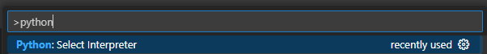
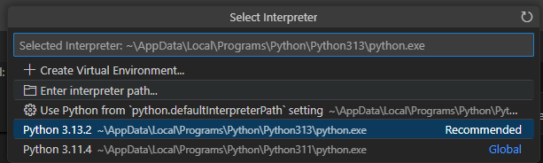
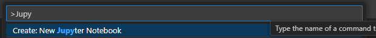

# Introduccion a Big Data:
Big Data se refiere al manejo y análisis de grandes volúmenes de datos que no pueden ser procesados eficientemente con herramientas tradicionales. No se trata solo del tamaño de los datos, sino también de su variedad, velocidad y veracidad. A menudo se resumen sus características en las llamadas "5 Vs":

- **Volumen:** Cantidad masiva de datos generados por fuentes como redes sociales, sensores, dispositivos IoT, transacciones, etc.

- **Velocidad:** Ritmo al que se generan y procesan los datos (en tiempo real o casi real).

- **Variedad:** Diversos tipos de datos, estructurados (como bases de datos), semiestructurados (como XML o JSON) y no estructurados (videos, imágenes, texto libre).

- **Veracidad:** Calidad y confiabilidad de los datos.

- **Valor:** Utilidad que se puede extraer de los datos a través del análisis.

## **Docker:**
Docker es una plataforma de código abierto que permite crear, empaquetar, distribuir y ejecutar aplicaciones dentro de contenedores. Un contenedor es como una "caja" ligera, portátil y aislada que incluye todo lo que una aplicación necesita para funcionar: código, librerías, dependencias y configuraciones.

### Contenedor:
- Se comporta como una máquina virtual ligera, pero más eficiente.
- Se ejecuta sobre el mismo sistema operativo del host, pero está aislado del resto del sistema.
- Permite ejecutar una app exactamente igual en diferentes entornos: tu laptop, un servidor, la nube, etc.

### ¿Para qué sirve Docker?
- Evitar el clásico “en mi máquina sí funciona”: Todo lo necesario para ejecutar tu app viaja dentro del contenedor.
- Despliegue rápido: Puedes lanzar múltiples instancias fácilmente.
- Entornos consistentes: Ideal para equipos de desarrollo y producción.
- Microservicios: Facilita dividir una aplicación grande en partes pequeñas, independientes.

### Conceptos Clave:
- **Dockerfile**: Archivo donde defines cómo se construye la imagen (qué base usar, qué instalar, qué ejecutar).
- **Imagen**: Una “foto” del contenedor. Es la plantilla que puedes ejecutar.
- **Contenedor**: Una instancia viva de una imagen.
- **Docker Hub**: Repositorio donde puedes encontrar o subir imágenes listas para usar.

### Ejemplo:

```dockerfile
FROM python:3.11
COPY . /app
WORKDIR /app
RUN pip install -r requirements.txt
CMD ["python", "main.py"]
```

### Instalación de Docker:

- Puedes descargarlo aquí: https://www.docker.com/products/docker-desktop
- Descarga e instala Docker Desktop (elige tu sistema operativo: Windows, macOS o Linux).
- Reinicia tu computadora después de la instalación.
- Asegúrate de que Docker esté corriendo:
    - En Windows, busca el ícono de Docker en la bandeja del sistema (debería decir “Docker is running”).
    - En Linux/macOS puedes usar en terminal:
```bash
docker --version
```

### Instalar la extensión de Docker en VS Code:

- En VS Code, ve a la barra lateral izquierda → ícono de extensiones (o usa Ctrl+Shift+X).
- Busca “Docker” (autor: Microsoft).
- Haz clic en Instalar.

Esta extensión te da una interfaz visual para ver imágenes, contenedores, redes y volúmenes desde dentro de VS Code.

### Crear un proyecto con Dockerfile:

- Abre o crea una carpeta para tu proyecto en VS Code.
- Dentro de esa carpeta, crea un archivo llamado Dockerfile. Por ejemplo, para una app Python:

```dockerfile
# Dockerfile
FROM python:3.11
WORKDIR /app
COPY . /app
RUN pip install -r requirements.txt
CMD ["python", "main.py"]
```

- También agrega tu requirements.txt y main.py si estás usando Python.

### Abrir terminal y construir imagen:

- Abre la terminal en VS Code (Ctrl + `) y ejecuta:
```bash
docker build -t miapp-python .
```
- Esto construye la imagen Docker con el nombre miapp-python.

### Ejecutar el contenedor:

```bash
docker run -d --name contenedor-python -p 8000:8000 miapp-python
```

- **-d** ejecuta el contenedor en segundo plano.
- **--name** le pone un nombre al contenedor.
- **-p** mapea el puerto 8000 del contenedor al 8000 de tu máquina.

### Verificar desde la extensión de Docker:
- En VS Code, haz clic en el ícono de Docker (barra izquierda).

Ahí verás:

- Tus contenedores activos y detenidos.
- Tus imágenes.
- Las redes y volúmenes creados.

### Limpiar contenedores e imágenes
- Detener contenedor:
```bash
docker stop contenedor-python
```
- Eliminar contenedor:
```bash
docker rm contenedor-python
```
- Eliminar imagen:
```bash
docker rmi miapp-python
```

## **Entorno Virtual**:
Un entorno virtual es un entorno de Python tal que el intérprete de Python, las librerías y los scripts instalados en él están aislados de los instalados en otros entornos virtuales y (por defecto) de cualquier librería instalada en el Python “del sistema”, es decir, el que se instala como parte de tu sistema operativo.

### Instalacion:
Es posible instalar en python **venv** para crear ambientes virtuales:
```bash
pip install virtualenv
```

### Creacion de un ambiente virtual:
En el terminal de VS code se utiliza el siguiente codigo:
#### Ejemplo:
```bash
python3.13 -m venv env
```
- Seguido de 'python' se coloca la version, en este caso 3.13
- Despues de colocar '-m venv' se coloca el nombre que quiera para la carpeta del virtual enviroment, en este caso 'env'.

### Activacion del ambiente virtual:
- Para MacOs el se debe correr el siguiente codigo en el powershell de VS code:
```bash
source env/bin/activate
```

- Para Windows se debe correr el siguiente codigo en powershell de VS code:
```bash
env/Scripts/Activate.ps1
```

### Prueba de funcionamiento del ambiente virtual:
- Primero debemos verificar las librerias instaladas en el ambiente virtual:
```bash
pip list
```
Deberia retornar ningun elemento, ya que el ambiente virtual esta recien creado.

### Configurar el lenguaje en el ambiente virtual:
- Sera necesario configurar el lenguaje de programacion necesario para compilar la informacion:
Presionar F1 en VS code y escribir: **Python: Select Interpreter**

- Seguidamente en las opciones se debera escoger: **Enter interpreter path...**, luego **Find...**
Y buscar el **python.exe** de la carpeta del ambiente virtual.

### Instalar requerimientos de librerias:
- Crear un archivo con el nombre **requirements.txt** en el directorio raiz donde van a estar escritas todas las librerias a utilizar en el proyecto de la siguiente manera:
```python
pandas
numpy
matplotlib
pyodbc
```
- Para instalar las librerias se debe ejecutar el siguiente codigo en powershell de VS code:
```bash
pip install -r requirements.txt
```
Esto instalara todas las librerias colocadas en el archivo requirements.

### Como desactivar el entorno virtual:
- Correr el siguiente codigo en powershell de VS code:
```bash
 ~ deactivate
 ```

 ## Como crear un notebook de Jupyter:
 - Presionar **F1** en VS code y colocar en el menu de busqueda: **Jupyter: Create new notebook**. De esta manera se creara un nuevo archivo formato jupyter notebook.
 